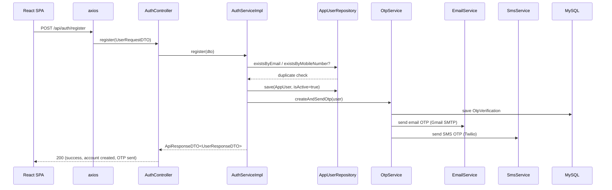
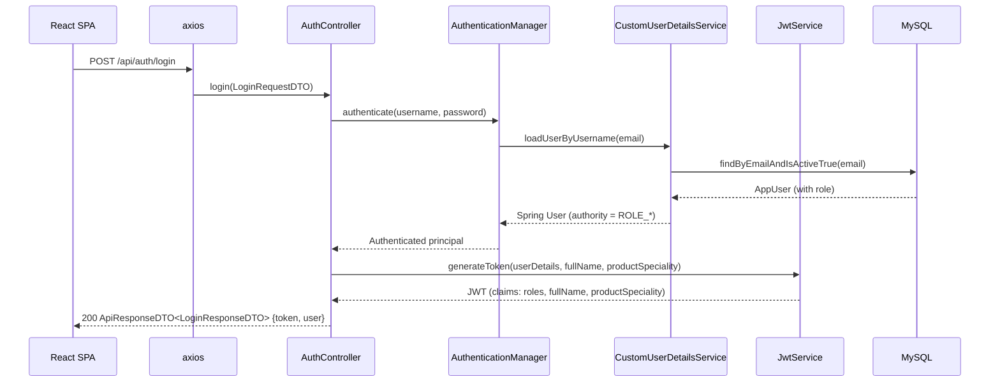
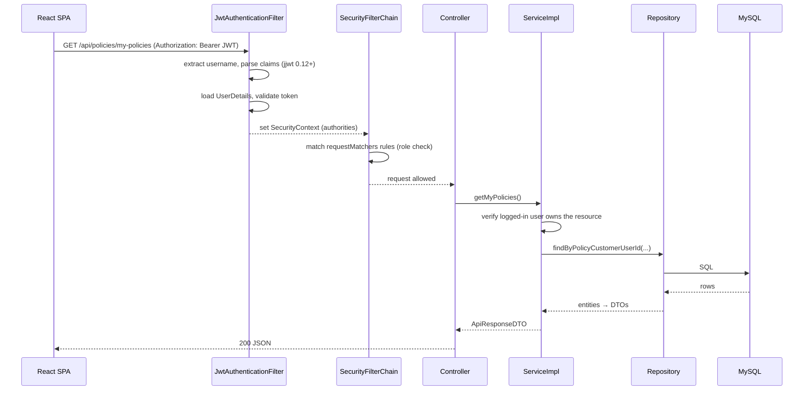
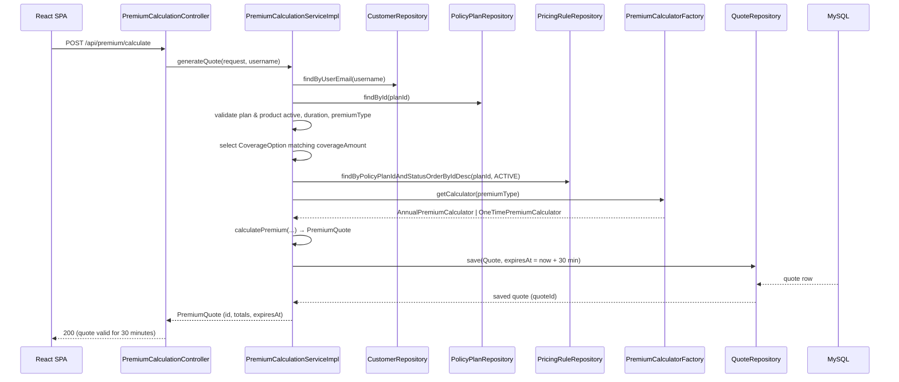
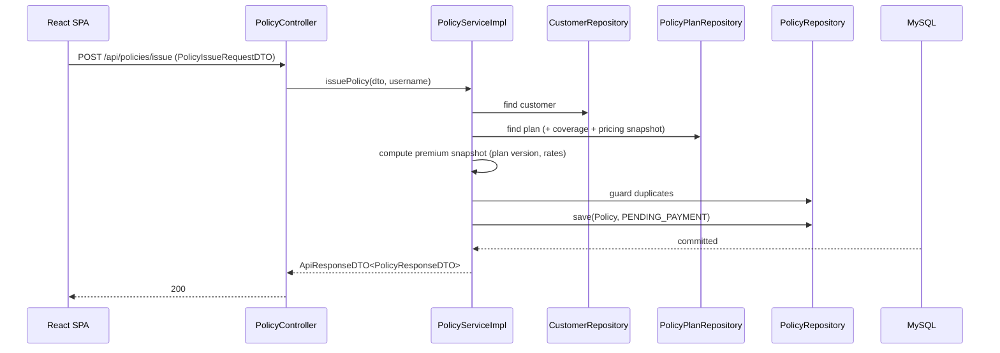
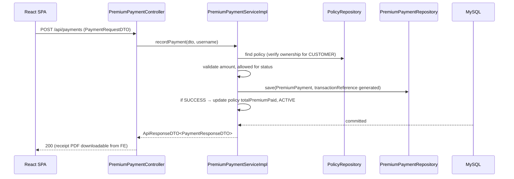
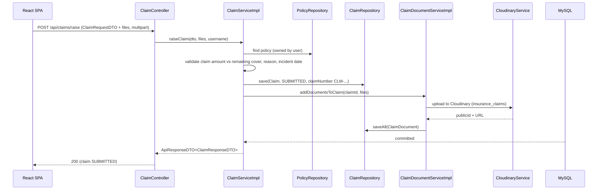
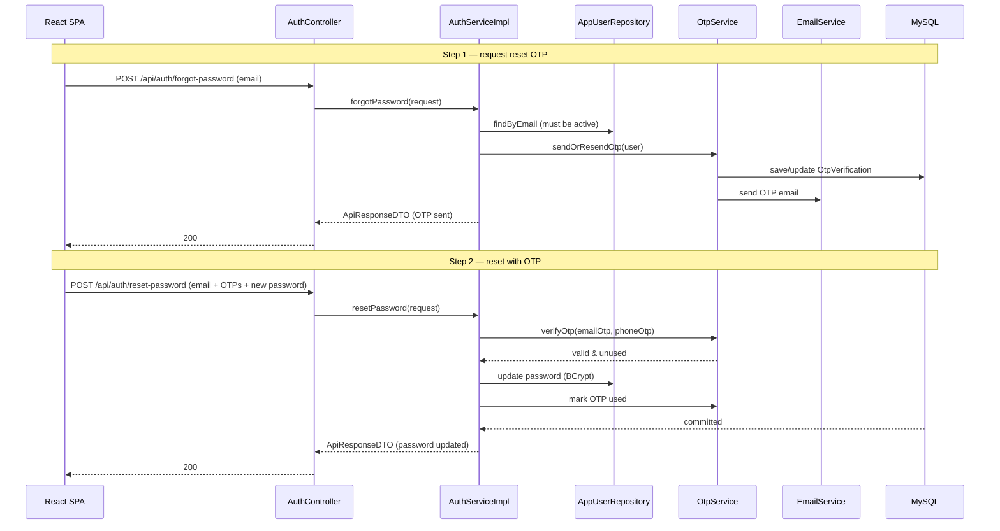

# Sequence Diagrams

Request-level sequence diagrams for the main business flows. These describe the implemented behavior in the current codebase (Spring Boot 4.0.6 / React 19). Frontend side is summarized to the axios layer; focus is on the backend execution path.

> Diagram conventions: `JwtFilter` = `JwtAuthenticationFilter` (security package), `Ctrl` = controller, `Svc` = service impl, `Repo` = Spring Data JPA repository, `DB` = MySQL. Entities/values are simplified.

---

## 1. Customer Registration



## 2. Login & JWT Issue



## 3. JWT Authentication & Authorization (protected call)



## 4. Generate Premium Quote (customer self-service)



## 5. Purchase Policy (customer self-service)

```mermaid
sequenceDiagram
    participant FE as React SPA
    participant C as PolicyController
    participant S as PolicyServiceImpl
    participant Q as QuoteRepository
    participant R as PolicyRepository
    participant U as AppUserRepository
    participant DB as MySQL

    FE->>C: POST /api/policies/purchase (QuotePurchaseRequest{quoteId})
    C->>S: purchasePolicy(quoteId, username)
    S->>Q: findById(quoteId)
    Q-->>S: Quote (status must be CREATED, not expired)
    S->>U: findByEmailAndIsActiveTrue(username)
    S->>R: guard: no duplicate active policy for same plan/customer
    S->>S: build Policy (PENDING_PAYMENT, from quote snapshot)
    S->>R: save(Policy)
    S->>Q: mark quote USED
    DB-->>S: committed
    S-->>C: ApiResponseDTO<PolicyResponseDTO>
    C-->>FE: 200 (policy created; payment needed to activate)
```

## 6. Issue Policy (admin / staff on behalf of customer)



## 7. Premium Payment (record / activate policy)



## 8. Raise Claim with Document Upload



## 9. Claim Review Workflow (maker-checker)

```mermaid
sequenceDiagram
    participant FE as React SPA
    participant C as ClaimController
    participant S as ClaimServiceImpl
    participant H as ClaimStatusHistoryRepository
    participant DB as MySQL

    Note over FE,DB: STAFF assigns claim to self
    FE->>C: PATCH /api/claims/{id}/assign
    C->>S: assignClaim(claimId, staffUsername)
    S->>H: record history
    DB-->>S: committed

    Note over FE,DB: STAFF marks under review
    FE->>C: PATCH /api/claims/{id}/under-review
    C->>S: markUnderReview(...)

    Note over FE,DB: STAFF reviews (recommend approve/reject)
    FE->>C: PATCH /api/claims/{id}/review (ClaimReviewRequestDTO)
    C->>S: reviewClaim(claimId, dto, staffUsername)
    S->>S: only INTERNAL_STAFF; history recorded
    DB-->>S: committed

    Note over FE,DB: ADMIN makes final decision
    FE->>C: PATCH /api/claims/{id}/final-decision (ClaimReviewRequestDTO)
    C->>S: finalDecision(claimId, dto, adminUsername)
    S->>S: only ROLE_ADMIN; APPROVED/REJECTED terminal
    S->>H: history record
    DB-->>S: committed
    S-->>FE: ClaimResponseDTO with status timeline
```

## 10. Forgot Password → Reset Password



## Coverage matrix

| # | Flow | Roles | Backend entry points |
|---|------|-------|----------------------|
| 1 | Registration + OTP | public | `POST /api/auth/register`, `POST /api/auth/verify-otp`, `POST /api/auth/resend-otp` |
| 2 | Login / JWT | public | `POST /api/auth/login` |
| 3 | Authenticated call | all | any protected endpoint (JwtAuthenticationFilter) |
| 4 | Premium quote | CUSTOMER, ADMIN/STAFF (`/admin/calculate`) | `POST /api/premium/calculate` |
| 5 | Purchase policy | CUSTOMER | `POST /api/policies/purchase` |
| 6 | Issue policy | ADMIN, INTERNAL_STAFF | `POST /api/policies/issue` |
| 7 | Premium payment | CUSTOMER, INTERNAL_STAFF | `POST /api/payments` |
| 8 | Raise claim + uploads | CUSTOMER | `POST /api/claims/raise`, `POST /api/document/upload/{claimId}` |
| 9 | Claim review (maker-checker) | INTERNAL_STAFF, ADMIN | `PATCH /api/claims/*/{assign,under-review,review,final-decision}` |
| 10 | Password reset | public | `POST /api/auth/forgot-password`, `POST /api/auth/reset-password` |

## See also

- [`imp-doc/04-workflows/auth-flow.md`](../imp-doc/04-workflows/auth-flow.md) — detailed auth workflow traces
- [`imp-doc/04-workflows/backend-workflows.md`](../imp-doc/04-workflows/backend-workflows.md) — 8 backend workflow traces
- [`imp-doc/07-diagrams/sequence-diagrams.md`](../imp-doc/07-diagrams/sequence-diagrams.md) — additional backend sequence diagrams
