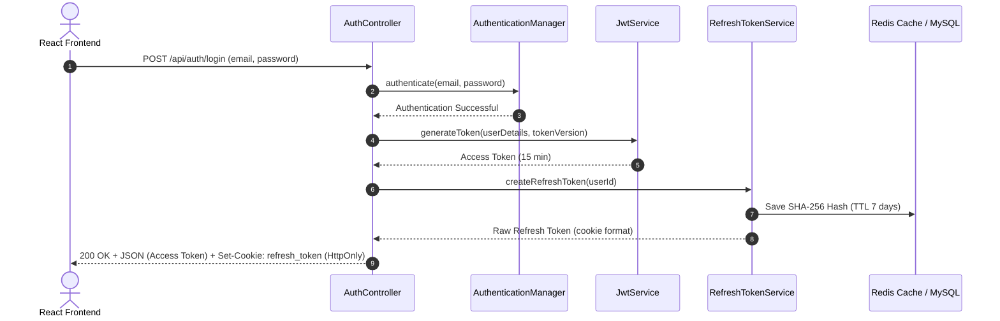
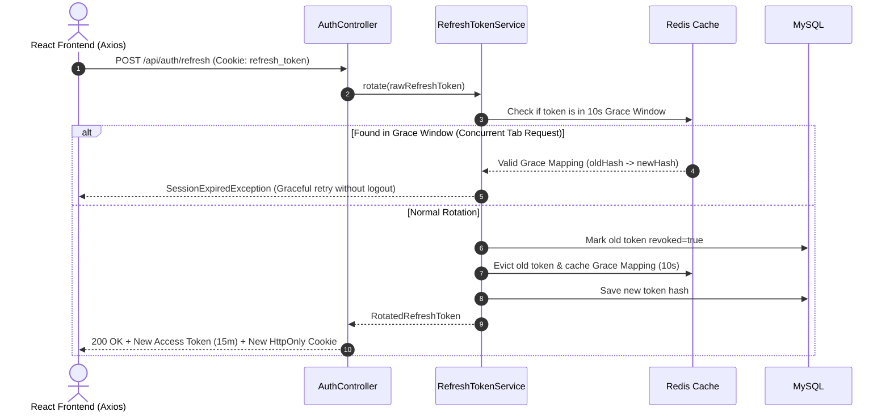
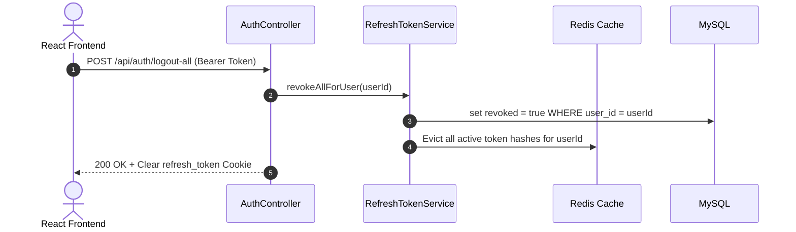

# Authentication Sequence Diagrams

---

## 1. Login & Token Generation Flow

```mermaid
sequenceDiagram
    autonumber
    actor Client as React Frontend
    participant Auth as AuthController
    participant AM as AuthenticationManager
    participant JWT as JwtService
    participant RT as RefreshTokenService
    participant Redis as Redis Cache / MySQL

    Client->>Auth: POST /api/auth/login (email, password)
    Auth->>AM: authenticate(email, password)
    AM-->>Auth: Authentication Successful
    Auth->>JWT: generateToken(userDetails, tokenVersion)
    JWT-->>Auth: Access Token (15 min)
    Auth->>RT: createRefreshToken(userId)
    RT->>Redis: Save SHA-256 Hash (TTL 7 days)
    RT-->>Auth: Raw Refresh Token (cookie format)
    Auth-->>Client: 200 OK + JSON (Access Token) + Set-Cookie: refresh_token (HttpOnly)
```

---

## 2. Token Refresh & Grace Window Flow

```mermaid
sequenceDiagram
    autonumber
    actor Client as React Frontend (Axios)
    participant Auth as AuthController
    participant RT as RefreshTokenService
    participant Redis as Redis Cache
    participant DB as MySQL

    Client->>Auth: POST /api/auth/refresh (Cookie: refresh_token)
    Auth->>RT: rotate(rawRefreshToken)
    RT->>Redis: Check if token is in 10s Grace Window
    alt Found in Grace Window (Concurrent Tab Request)
        Redis-->>RT: Valid Grace Mapping (oldHash -> newHash)
        RT-->>Client: SessionExpiredException (Graceful retry without logout)
    else Normal Rotation
        RT->>DB: Mark old token revoked=true
        RT->>Redis: Evict old token & cache Grace Mapping (10s)
        RT->>DB: Save new token hash
        RT-->>Auth: RotatedRefreshToken
        Auth-->>Client: 200 OK + New Access Token (15m) + New HttpOnly Cookie
    end
```

---

## 3. Logout All Devices Flow

```mermaid
sequenceDiagram
    autonumber
    actor Client as React Frontend
    participant Auth as AuthController
    participant RT as RefreshTokenService
    participant Redis as Redis Cache
    participant DB as MySQL

    Client->>Auth: POST /api/auth/logout-all (Bearer Token)
    Auth->>RT: revokeAllForUser(userId)
    RT->>DB: set revoked = true WHERE user_id = userId
    RT->>Redis: Evict all active token hashes for userId
    Auth-->>Client: 200 OK + Clear refresh_token Cookie
```
