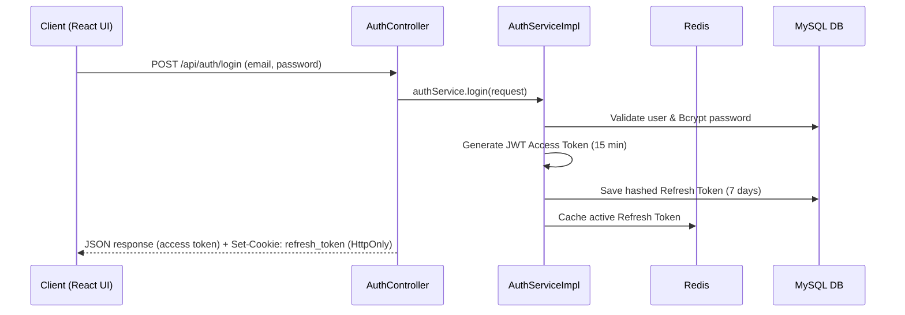
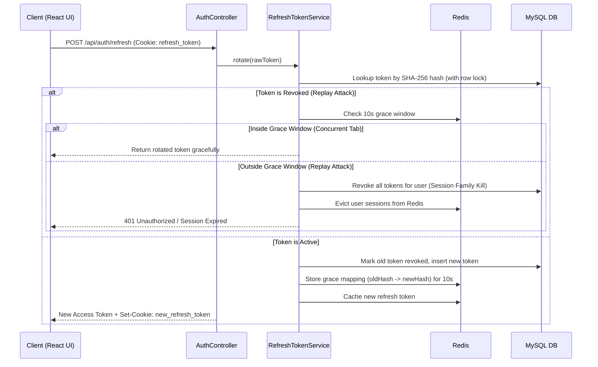
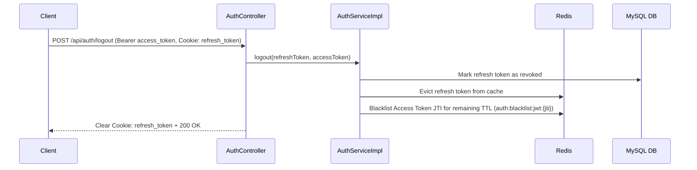

# Authentication & Session Management Architecture

## 1. Executive Summary & Design Strategy

The Insurance Policy Claim Management System uses a **hybrid authentication strategy** designed for high security, low latency, and clean separation of concerns in a stateless REST API architecture:

- **Short-Lived Stateless Access Tokens (JWT)**: 15-minute expiration (`900,000 ms`). Used for API authorization without database lookups on every request.
- **Long-Lived Opaque Refresh Tokens**: 7-day expiration. Stored as SHA-256 hashes in MySQL (`refresh_tokens` table) and cached in Redis. Delivered exclusively via `HttpOnly`, `SameSite=Lax` cookies scoped to `/api/auth`.
- **Refresh Token Rotation with Replay Detection**: Every refresh request invalidates the old token and issues a new pair. Presenting an already-revoked refresh token triggers **session family revocation** (invalidating all sessions for that user).
- **Grace Window**: A 10-second Redis grace window (`auth:refresh:grace:`) prevents race conditions and false-positive replay detections when concurrent browser tabs refresh tokens simultaneously.

---

## 2. Token Flow Sequence Diagrams

### Login Flow

### Automatic Token Refresh Flow (Axios Interceptor)

### Logout & Access Token Blacklisting

---

## 3. Key Component Reference

| Component | File Path | Role & Responsibility |
|---|---|---|
| `SecurityConfig` | `config/SecurityConfig.java` | Central Spring Security 6 filter chain configuration, CORS, CSP/HSTS headers, and stateless session policy. |
| `JwtService` | `security/JwtService.java` | HMAC-SHA256 JWT generation and validation, clock skew tolerance (`30s`), and token version claim verification. |
| `RefreshTokenService` | `security/RefreshTokenService.java` | Atomic refresh token rotation, replay detection, grace window handling, and session family revocation. |
| `RedisTokenCacheService` | `security/cache/RedisTokenCacheService.java` | Abstraction for Redis token caching, JWT JTI blacklisting, and graceful fallback to SQL if Redis is offline. |
| `RefreshTokenCookieManager` | `config/RefreshTokenCookieManager.java` | Builds and clears `HttpOnly`, `SameSite=Lax` cookies scoped to `/api/auth`. |
| `JwtAuthenticationFilter` | `security/JwtAuthenticationFilter.java` | Intercepts bearer tokens, checks Redis JWT blacklist, validates claims, and populates `SecurityContext`. |
| `RefreshTokenCleanupScheduler` | `config/RefreshTokenCleanupScheduler.java` | Scheduled cron job (`0 0 2 * * *`) that purges expired and old revoked tokens from MySQL. |

---

## 4. Architectural Trade-offs & Interview FAQ

### Q1: Why use both JWT Access Tokens and Opaque Refresh Tokens?
- **Why**: Access tokens are stateless, allowing fast API authorization without database hits on every request. Opaque refresh tokens are stored in the database, allowing immediate server-side revocation on logout, password reset, or security compromise.
- **Trade-off**: Requires storing refresh tokens in MySQL and Redis, but avoids the security risks of long-lived stateless JWTs that cannot be revoked.

### Q2: How does the system handle concurrent refresh requests from multiple browser tabs?
- **Why**: When multiple tabs open or wake from sleep simultaneously, they may all attempt to refresh the session at once using the same refresh token.
- **How**: `RefreshTokenService` stores a 10-second grace token mapping in Redis (`auth:refresh:grace:{oldHash}`). If a second request presents a recently rotated token within those 10 seconds, the service recognizes it as a benign concurrent tab refresh rather than an attacker replay attack, preventing accidental logout.

### Q3: What happens if Redis goes down?
- **Why**: System reliability and fault tolerance.
- **How**: Every Redis operation in `RedisTokenCacheServiceImpl` is wrapped in try/catch blocks with `isRedisAvailable()` checks. If Redis is offline or disabled, token caching and blacklisting gracefully degrade to no-ops, and MySQL remains the authoritative source of truth.

### Q4: Why are refresh tokens hashed with SHA-256 in the database?
- **Why**: Defense in depth. If an attacker gains read access to the MySQL database (e.g., via SQL injection or backup leak), they cannot use the stored token hashes to impersonate users.

### Q5: How are stolen tokens mitigated?
- **How**:
  1. **Replay Detection**: Using an already-revoked refresh token revokes all active tokens for that user (`revokeSessionFamily`).
  2. **Immediate Logout**: Logout revokes the refresh token in MySQL/Redis and blacklists the access token's JTI in Redis (`auth:blacklist:jwt:{jti}`) for its remaining TTL.
  3. **Token Versioning**: Password resets or account deactivation increment `AppUser.tokenVersion`, instantly invalidating all existing JWT access tokens for that user.
